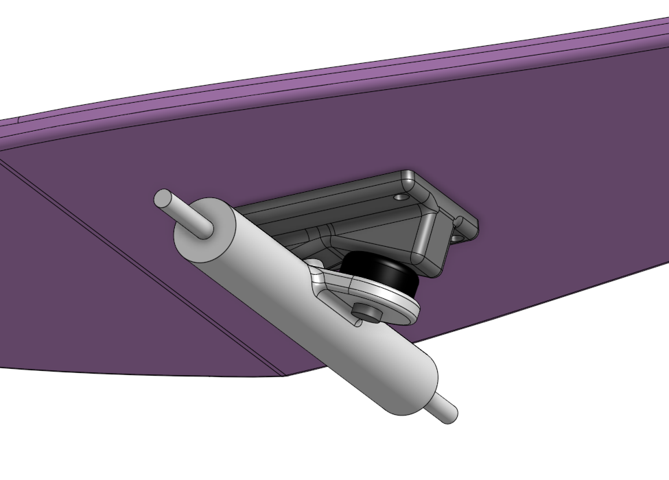
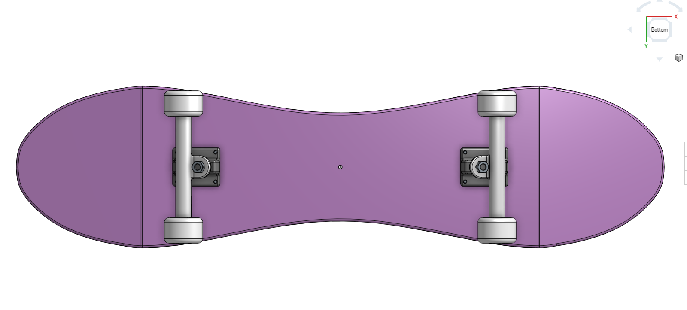
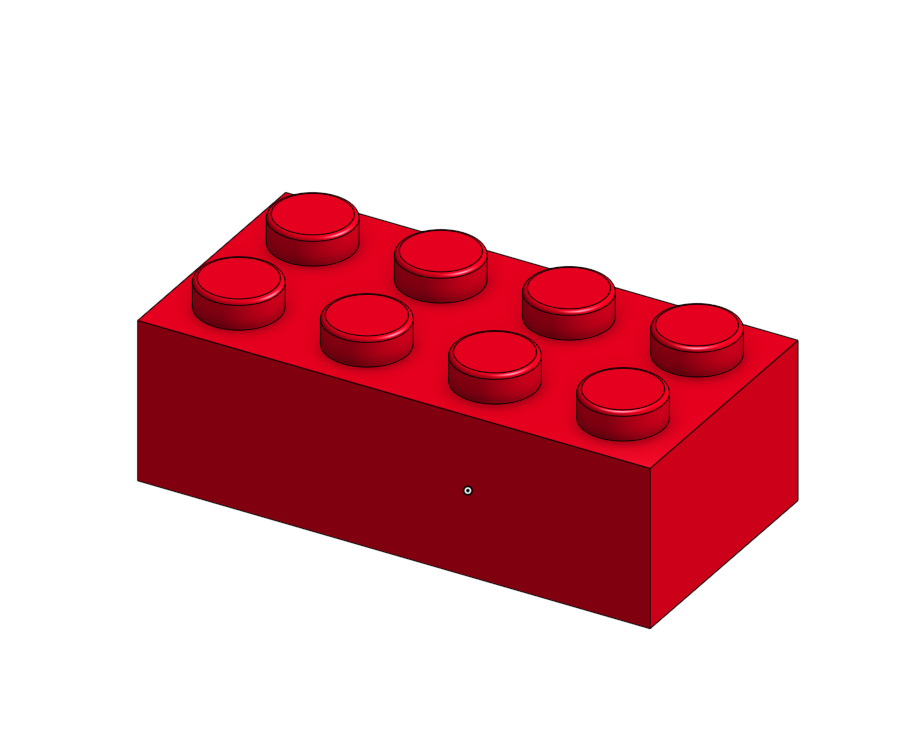
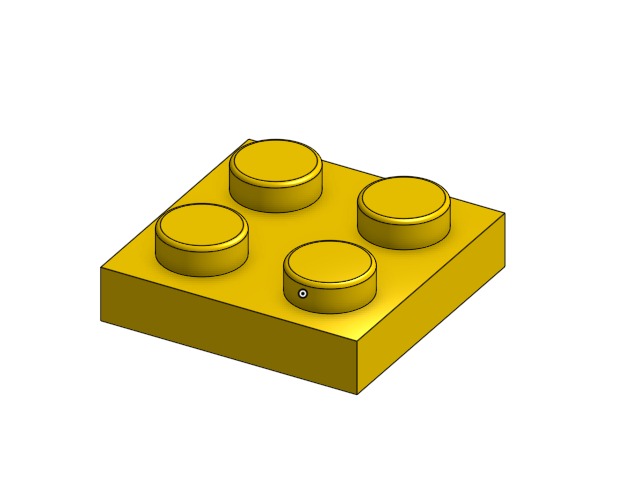
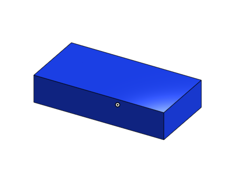
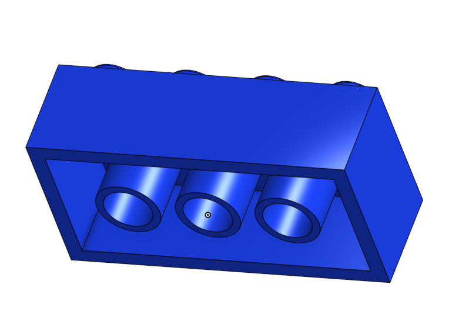

# CAD_Engineering_3

## Table of Contents
* [Skateboard](#Skateboard)
* [Power Tools](#Power_Tools)

## Skateboard

### Description
This assignment was to design a skateboard using Part Studios in OnShape, in order to use the geometry of the other parts to make the modelling of the subsequent parts easier. The skateboard is composed of a deck, trucks, which consist of a baseplate, hanger, and bushing, wheels, and bearings for the wheels.

### Evidence
[OnShape Document](https://cvilleschools.onshape.com/documents/e34b09b561f390463bdd1626/w/33b8fcdd82c4df8aadd50ca4/e/6074d804d4f975e5f0609025?renderMode=0&uiState=6169cebf0f8075515dee6044)

### Images
  

### Reflection
This assignment was a good re-introduction to OnShape, and included a lot of helpful tips on various keyboard shortcuts. Some of the most helpful include "n", for normal, which situates a sketch or face normal to the nearest plane, "f", for fill, which causes the part(s) to fill the whole screen, "shift+e" to extrude, "d" to dimension, "c" for circle, and "shift+f" to fillet. 

[Back to Table of Contents](#Table_of_Contents)

## Power_Tools

### Description
This assingment created a LEGO-like block that could be configured with different lengths, names, colours, types, and heights, using variables and configurations. By configuring different aspects of the part, all these can be manipulated simply by changing the configuration of the part. 

### Evidence
[OnShape Document](https://cvilleschools.onshape.com/documents/ed1a07c649738c77eab5d2cf/w/d6bda4fdf2ef58b6f1d4500e/e/87b5ddf251ffa55f171ec4d3)

### Images
   

### Reflection
This assignment introduced configurations, a powerful OnShape tool which allows for the manipulation of different values and lengths in an object. For this assignment, configuring the numbers of rows and columns was a very effective way to change the shape and size of the brick. Additionally, the use of feature scripts to build useful custom features features is an incredibly powerful tool, and can be used to add certain features not included inherently with OnShape. 

[Back to Table of Contents](#Table_of_Contents)
