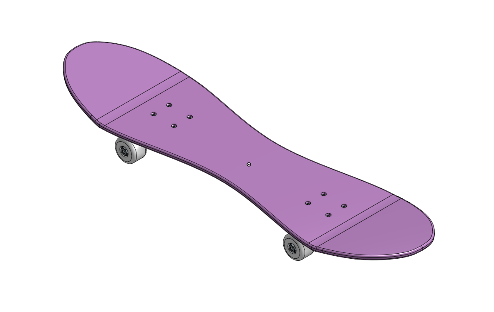
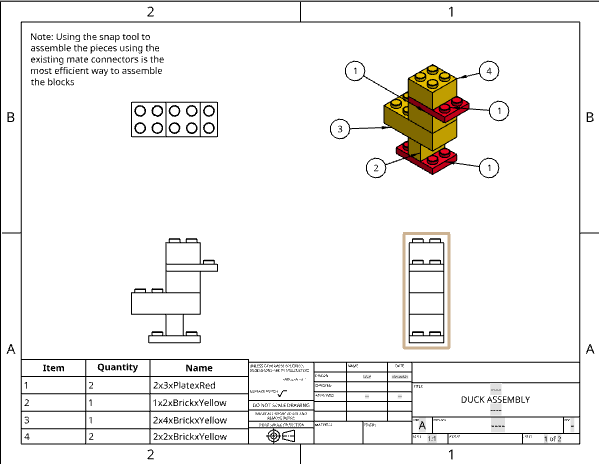

# CAD_Engineering_3

## Table_of_Contents
* [Skateboard](#Skateboard)
* [How the Pros Do It & One Brick to Rule Them All](#One_Brick_to_Rule_Them_All)
* [Duck Assembly](#Duck_Assembly)

## Skateboard

### Description
This assignment was to design a skateboard using Part Studios in OnShape, in order to use the geometry of the other parts to make the modelling of the subsequent parts easier. The skateboard is composed of a deck, trucks, which consist of a baseplate, hanger, and bushing, wheels, and bearings for the wheels. The deck's geometry consisted of a rectangle, centered on the origin, and two circles, with four holes cut into the deck and mirrored across the origin. The baseplate of the trucks is based on these holes, where is would be screwed in, and the hanger and bushing use the geometry of the baseplate where they would be attached. The wheels and bearings were made in a different part studio, with the revolve feature used to create the wheel, and the bearing made using the shallower inside of the wheel.

### Evidence
[OnShape Document](https://cvilleschools.onshape.com/documents/e34b09b561f390463bdd1626/w/33b8fcdd82c4df8aadd50ca4/e/6074d804d4f975e5f0609025?renderMode=0&uiState=6169cebf0f8075515dee6044)

### Images
   

### Overall Reflection
This assignment was a good re-introduction to OnShape, and included a lot of helpful tips on various keyboard shortcuts. Some of the most helpful include "n", for normal, which situates a sketch or face normal to the nearest plane, "f", for fill, which causes the part(s) to fill the whole screen, "shift+e" to extrude, "d" to dimension, "c" for circle, and "shift+f" to fillet. 

#### Deck Reflection
The deck of the skateboard was based on fairly basic geometry, just two circles centered on the sides of a rectangle, dimensioned, and extruded. This assignment was a basic introduction to various OnShape tools, but the most useful thing about this assignment was definitely the instructions relating to keyboard shortcuts, including "shift+s" to sketch, "n" for normal, and "c" for a circle. The "hole" feature was also quite useful, as it can be used to create holes corresponding to a specific type of screw.

#### Trucks Reflection
The trucks were built using the holes of the deck to create geometry for a baseplate, hanger, and bushing. The "use" feature can be used while sketching to use geometry from existing sketches or parts in that sketch, enabling the usage of the holes of the deck without having to dimension them separately (the keyboard shortcut is "u"). The hanger and bushing are also made using the relevant geometry from the baseplate and deck.

#### Wheels and Bearings Reflection
The wheel was made using the revolve feature, rather than extrude, to create a rounded shape like a cylinder whose geometry is "revolved" around a centreline. Construction lines are also used, which can be used by using the shortcuts "l" for line and "q" for construction, for some reason. The bearings are made using the geometry of the wheel.

#### Assembly Reflection
The mate system in OnShape makes assembling parts really easy using mate connectors. Mate connectors exist based off of part geometry, and can be added to parts for convenience. "K" is a useful command to turn off all the appearances of mate connectors. OnShape also has a cool feature where standard sized screws, bolts, and other standard components that can be used to assemble things are included and can easily be inserted and assembled in an assembly.

#### Bending the Board and Other Add-ons
For the extension, I bent the board, made the trucks realistic, and changed the shape of the board. This assignment really just drew on the shortcuts and methods used in the previous sections to make the construction more efficient. I used all of the shortcuts that I have been over in this documentation. 

[Back to Table of Contents](#Table_of_Contents)

## One_Brick_to_Rule_Them_All

### Description
This assignment created a LEGO-like block that could be configured with different lengths, names, colours, types, and heights, using variables and configurations. Configurations are a powerful OnShape tool which allows for the manipulation of different values and lengths in an object. For this assignment, configuring the numbers of rows and columns was a very effective way to change the shape and size of the brick, starting with a 2x4 brick and creating configurations for 2x3, 2x2, 1x4, and 1x2 bricks, with configurations for a plate (short) and a tile (no connectors on top), and in blue, red, and yellow. The use of feature scripts to build useful custom features features, in this instance different names and colours for the bricks, is an incredibly powerful tool, and can be used to add certain features not included inherently with OnShape.

### Evidence
[OnShape Document](https://cvilleschools.onshape.com/documents/ed1a07c649738c77eab5d2cf/w/d6bda4fdf2ef58b6f1d4500e/e/87b5ddf251ffa55f171ec4d3)

### Images
   

### Reflection
This assignment used configurations to more efficiently build a LEGO block. The shell tool is useful to create, well, a shell, and the lines from other parts, including those not originally defined by sketch geometry, can be used via the "use" feature in new sketches. Additionally, the unsupressed configuration is useful to correct for when things don't work at different configurations.

[Back to Table of Contents](#Table_of_Contents)

## Duck_Assembly

### Description
This assignment was to use the blocks built in the Power Tools assignment to build a duck assembly. Additionally, the continuation of this assignment was to create an instruction manual using OnShape drawings.

### Evidence
[OnShape Document](https://cvilleschools.onshape.com/documents/ed1a07c649738c77eab5d2cf/w/d6bda4fdf2ef58b6f1d4500e/e/f17eb32a8a420d4228c11109?renderMode=0&uiState=616d7eecbee0f16f0f8d1eed)

### Images
    

### Reflection
The snap tool was used in this assignment to create mates using mate connectors which snap together, making use of the mate connectors added and patterned in the block building assignment. The exploded view feature is also used to create a more descriptive assembly view to provide instructions for the building of the assembly, which makes recreation easier and more efficient. The most useful keyboard shortcut used in this assignment was "k" in assembly to hide visible mate connectors, which can get in the way, and holding "shift" to be able to keep normally hidden mate connectors shown. Additionally, in the drawing, sleceted shaded view shows the colours!

[Back to Table of Contents](#Table_of_Contents)
